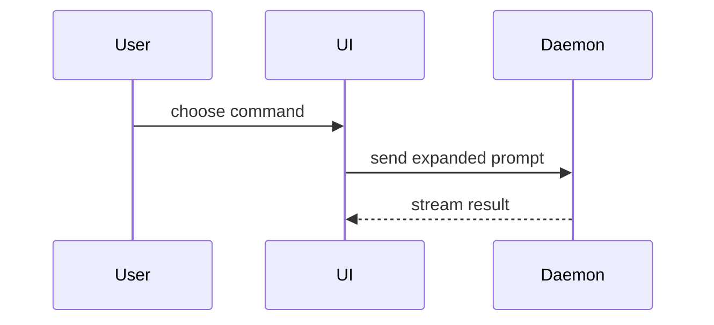

# Opening a PR in IRYSS

Every step here exists because skipping it produced a wrong PR once: the wrong base branch, a
104-file commit, a made-up label. Do all of them in order.

## 1. Find the real base branch, never assume `main`

`main` can be far behind the branch everything actually merges into. Check what recent PRs
really targeted before picking a base:

```bash
gh pr list --state merged --limit 5 --json number,title,baseRefName,headRefName,mergedAt
```

Then confirm with a commit count, not a guess:

```bash
git fetch origin <candidate-base> --quiet
git log --oneline origin/<candidate-base>..HEAD | wc -l
```

The right base is the one where that count matches the work actually on this branch (single
digits for a normal PR), not hundreds. `main` here was 150 commits behind while
`feat/storefront-configuration` was the branch every recent PR (#26-30) actually targeted, and
`git merge-base` against the wrong candidate silently includes someone else's unmerged history
in the diff.

## 2. Commit by feature, not by "everything at once"

A PR title makes one claim. A working tree with several unrelated fixes tangled together
cannot back that claim, whatever the title says. Before touching git:

1. `git status --porcelain=v1` and `git diff` to map every changed file to the feature it
   belongs to.
2. For each feature, stage only its files and diff `--stat` to sanity check the scope before
   committing.
3. **When one file has hunks from two features genuinely interleaved** (there is no
   `git add -p` here, interactive flags are disallowed): reconstruct the file's state for
   feature A only, verify that state on its own with a scoped `vitest run`, commit, then put
   feature B's hunks back on top of the committed base and verify again.
4. Before every commit: `bun run check-types`, `bun run test`, and `bunx biome check <staged
   files>` at the repo root, not just the touched package. A change that compiles alone can
   still break a sibling that imports it.
5. Conventional commit message, ASCII only, explains why not what, no `Co-Authored-By`
   trailer. Start a body paragraph with a word rather than a `word:` token, or commitlint
   reads it as a footer and warns.

Don't wait to be asked before flagging it: if the tree turns out to hold more than the one
thing you were told about, say so and propose the split rather than silently committing
everything as one commit.

## 3. Pull in the tickets

Before writing the body, find every Linear ticket the work closes or touches:
`mcp__linear__get_issue` for anything already referenced in the conversation,
`mcp__linear__list_issues` with `parentId` for sub-issues of a parent ticket. Read each one;
don't just link the id. A ticket with no Linear equivalent (a fix that came from a code
review, a branch's own original scope) still gets a line in the Summary, it just has no link.

Check `assignee` before writing code for a ticket. One assigned to someone else is theirs to
build.

## 4. Body shape: simple, list-first, no ceremony

```markdown
## Summary

<the one visual that makes the change legible, then one bullet per distinct piece of work>

- **Thing one** ([IRY-N](url)): what was broken, one sentence, and what the fix does.
- **Thing two** (no ticket, matches this branch's original scope): same shape.

## Changes

- [x] Short past/imperative line per commit, in commit order

## Verified

Before and after. What was actually run and passed, naming the tier.

## Merge Danger

Only when the answer is interesting. One-way or two-way door, and the blast radius.
```

Every top-level bullet must trace to an actual commit on the branch. If a bullet needs three
sentences to justify itself, the commit it describes is not scoped tightly enough yet: go back
to step 2.

Skip all preambles and keep prose brief. Domain language comes from
`docs/business-architecture/` and the module's own `README.md`.

## 5. Assignee and labels come from the repo, not from memory

```bash
gh api user --jq '.login'      # this session's authenticated user, for --assignee
gh label list                   # the actual label taxonomy - never invent one
```

Pick labels that match what the diff touches: a `type: fix`/`type: feat`/etc. for the dominant
kind of change, one `area: *` per app or package meaningfully touched, and any status label
(`security`, `breaking change`) the content actually earns. A rank or permission-check fix
earns `security`; a repository rename does not.

## 6. Push and create

```bash
git push -u origin <branch>
gh pr create --base <verified-base> --head <branch> \
  --title "<type>(<scope>): <summary>" \
  --body-file <path> \
  --assignee <login> \
  --label "type: x" --label "area: y" ...
gh pr view <number> --json title,assignees,labels,baseRefName,headRefName,url
```

Let `pre-push` run. It is `lint`, `format`, `fix`, `check`, `check-types`, `test:coverage`,
`build`, and it passes on a healthy tree. `--no-verify` is for a gate that is itself broken,
needs the user's explicit say-so, and leaves whatever it skipped still to be run. Because
`format` and `fix` write, read `git status` after a push that took a while.

The final `gh pr view` is not optional: confirm the base, assignee and labels landed as asked
before reporting the PR back as done.

---

# Choosing the visual

Reference for the `## Summary` and `## Verified` sections above.

## Summary

Pick the smallest view that makes the key point clear.

- Show logic or an algorithm as pseudocode:

```text
on(save)
  if content is unchanged
    return cached result
  write new content
  return fresh result
```

- Show runtime control flow as a call tree:

```text
submitForm
  createSession
    persistPrompt
    launchAgent
  navigateToSession
```

- Show UI structure as a component tree, including state and module boundaries that matter:

```tsx
<SessionPage>(apps / example / src / routes / session.tsx);
useSessionEvents() < SessionToolbar > <RunSkillButton>(packages / ui);
```

- Show file responsibility or a broad refactor as a shallow file tree:

```text
src/
├── commands/       # parses user actions
├── sessions/       # owns session state
└── transport/      # sends API requests
```

- Show component interaction, control flow, or data flow with Mermaid:



- Use `diff` when the point is what changes and the surrounding shape already exists. Match
  the diff shape to the topic.

For a component change:

```diff
 <SessionPage>
   useSessionEvents()
   <SessionToolbar>
+    <RunSkillButton />
   <SessionTimeline>
+    <SkillResultCard />
```

For a file-layout change:

```diff
 src/
 ├── commands/
+│   └── show-me.ts       # expands the slash command
 ├── sessions/
-└── transport.ts
+└── transport/
+    ├── client.ts
+    └── stream.ts
```

For a call-tree or call-stack change:

```diff
 submitForm
   createSession
     persistPrompt
+    expandSkillMention
     launchAgent
-  navigateToSession
+  navigateToSession
+    subscribeToEvents
```

For a state or control-flow change:

```diff
 on(save)
-  write content
+  if content is unchanged
+    return cached result
+  write new content
+  invalidate cache
```

- Show the whole block when most of it is new, when omitted context would hide ownership or
  order, or when the user needs a copyable target shape:

```ts
function expandSkill(command: string): string {
  const skillName = command.slice(1)
  return `use the ${skillName} skill`
}
```

### Guidance

Place each visual next to the short text it supports. Keep only the calls, files, props,
states, and boundaries needed to answer the user's current question or the options to
resolve the current discussion point.

You may use one of these, you may use several, it is unlikely you will use all of them. Use
your judgement and don't overwhelm the user.

Three shapes recur in this monorepo and are worth reaching for first:

- **A schema or constraint change** reads as a diff of the column and the constraint that
  guards it, because the CHECK is the behaviour.
- **A module added or reshaped** reads as the shallow file tree of
  `modules/{module}/`, which is the shape
  `docs/business-architecture/modules/01-commerce-api/patterns.md` sets.
- **A permission change** reads as the scope ladder it walks, since who a route admits is
  the whole point and prose hides it.

## Verified

Concrete evidence that the change works. Show a before and after.

Screenshots are S-tier, when the environment is set up for it and the change is visual.

Execution-based evidence is A-tier. Test results, console output. Show the exact test that
now fails and passes.

Name the tier something ran at, because the three prove different things here:
`bun run test` is hermetic, `test:integration` and `test:e2e` need a live Postgres. "Tests
pass" without the tier is not evidence, and a claim that e2e passed is only true if the
reference data was seeded first.

## Merge Danger

Add this section when the answer is interesting. Describe whether it's a one-way or two-way
door. You can walk back through two-way doors, but not one-way doors. A PR that is cheap to
roll back is lower risk. Changes that involve destructive actions or hard-to-reverse
decisions are one-way doors.

The blast radius is the potential impact or scope of the changes introduced by this PR.
Consider all possibilities. Examples are layout shift, breakages for consumers, mobile
responsiveness, etc.

Four things are one-way doors in this repo and deserve saying so in the body:

- **A migration**, because an applied one is not un-run by reverting the PR, and an
  out-of-order timestamp is skipped silently while migrate prints success.
- **A widened IAM grant**, because every session holding it has to be re-evaluated to know
  what it reached in the meantime.
- **A published SDK regeneration**, since consumers compile against it.
- **A deleted column or dropped constraint**, which takes the data with it.
