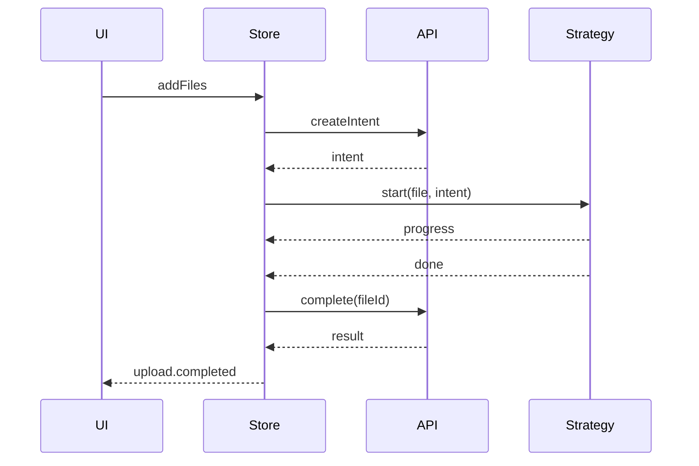

Contracts define the integration points between your backend, transport, and strategies.

## UploadApi

Your backend adapter implements:

- `createIntent` -- returns a strategy intent describing how the file should be uploaded
- `complete` -- returns a typed result after the upload finishes
- optional `findByChecksum` for deduplication
- optional multipart and tus helpers

## UploadTransport

Transport handles raw HTTP requests (XHR or fetch). The default implementation uses XHR because it supports upload progress events.

## Strategy Contracts

Strategies implement a single method:

```ts
start(ctx: StrategyCtx): Promise<void>
```

The engine provides `file`, `intent`, `transport`, `api`, and cursor helpers via the context object.

## Upload Lifecycle Sequence


