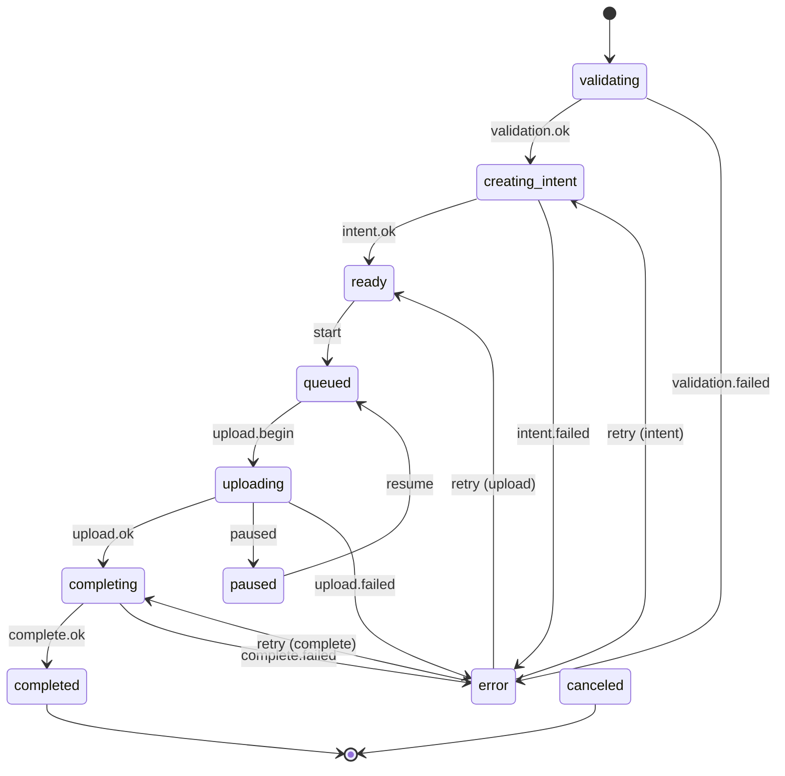

The engine manages the upload state machine, scheduling, and side effects. All state changes go through the reducer, and all public events emit from a single transition layer.

## State Machine

## Scheduling

The scheduler continuously makes progress:

- **Intent creation** for items in the `creating_intent` phase
- **Upload slots** for `queued` items, respecting the configured concurrency limit
- **Finalization** for items in the `completing` phase

## Event Emission

Public events are emitted by `store.runtime.ts` after transitions, not inside handlers. This prevents duplicates and ensures consistent semantics.

| Internal Event | Public Event |
| --- | --- |
| `validation.ok` | `validation.ok` + `intent.creating` |
| `upload.begin` | `upload.started` |
| `upload.ok` | `upload.completing` |
| `complete.ok` | `upload.completed` |

`file.rejected` is emitted during `addFiles` because rejected files never enter state.

## Retry Model

`retryDecision` centralizes retry policy. Handlers only request a decision; they never hardcode retry logic. The default configuration allows up to 3 attempts with exponential backoff.
