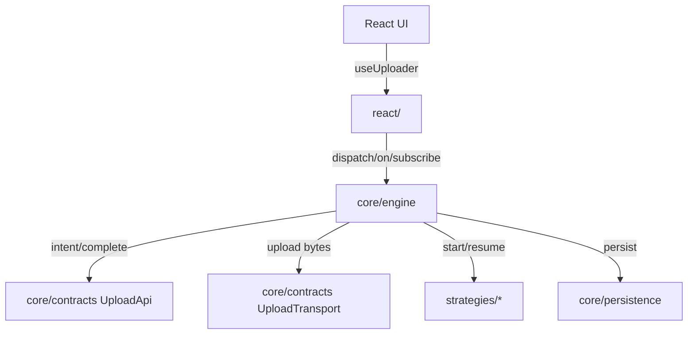

## What is Duck Upload?

Duck Upload is a modular upload engine with strategy plugins and thin React bindings. It is structured like **React Query for uploads**: a core client that owns state and scheduling, pluggable upload strategies, and a small React adapter.

## Package Structure

```
src/
  core/           # engine + contracts + persistence + utilities
  strategies/     # protocol implementations + registry helper
  react/          # provider + hooks
```

## Architecture at a Glance



## Quick Lifecycle

1. `addFiles` dispatches files into the store with validation
2. `start` or `autoStart` queues the item for upload
3. The matched strategy uploads bytes, reporting progress
4. `complete` finalizes the upload and returns a typed result
5. Public events emit from a single transition layer

## Quick Start

```ts
import { createUploadStore } from '@gentleduck/upload/core'
import { createStrategyRegistry, PostStrategy, multipartStrategy } from '@gentleduck/upload/strategies'

const strategies = createStrategyRegistry()
strategies.set(PostStrategy())
strategies.set(multipartStrategy())

const store = createUploadStore({
  api, // implements UploadApi
  strategies,
  config: {
    autoStart: (purpose) => purpose === 'avatar',
  },
})
```

### Wait For Results

```ts
const { items } = store.getSnapshot()
const localIds = Array.from(items.keys())

const outcomes = await store.waitFor(localIds)
for (const outcome of outcomes) {
  if (outcome.status === 'completed') {
    console.log(outcome.result.fileId, outcome.result.key)
  }
}
```

## Architecture Goals

- One cohesive **core** with immutable state updates and centralized event emission.
- Strategies are **pluggable** and do not leak into core.
- React layer is **thin** and only consumes store APIs.
- All types live **next to their module** (no mega types folder).

## What This Documentation Covers

- **Core**: engine behavior, state machine, contracts, persistence
- **Strategies**: POST and multipart protocols, plus the strategy registry
- **React**: provider and hooks, UI patterns
- **Utilities**: shared helpers and guards
- **Design**: architecture decisions and rationale

If you are new, start with [Core Overview](/docs/core), then [Engine](/docs/core/engine), and [React Overview](/docs/react).
